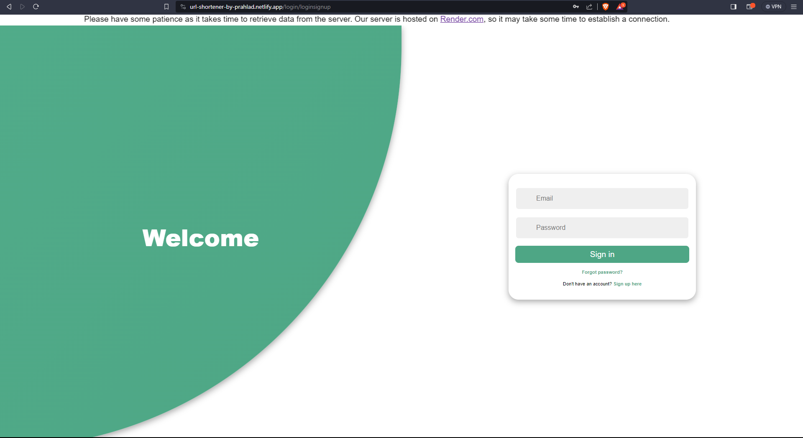
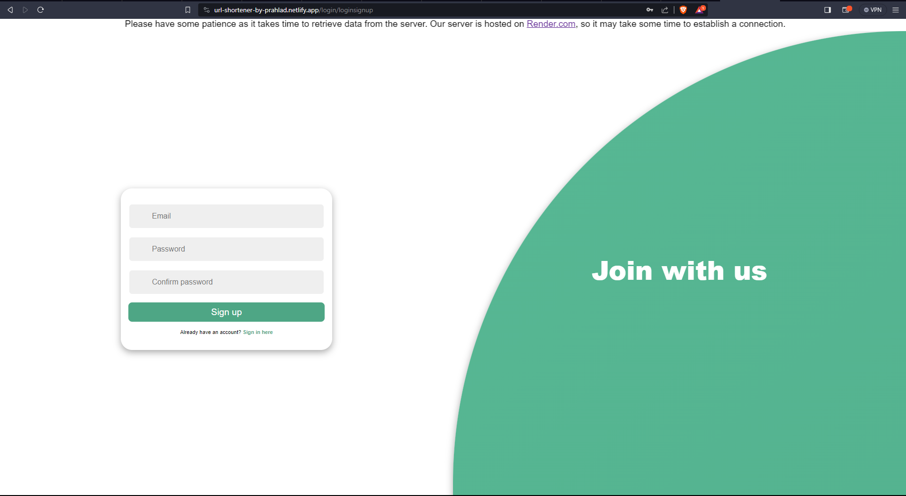
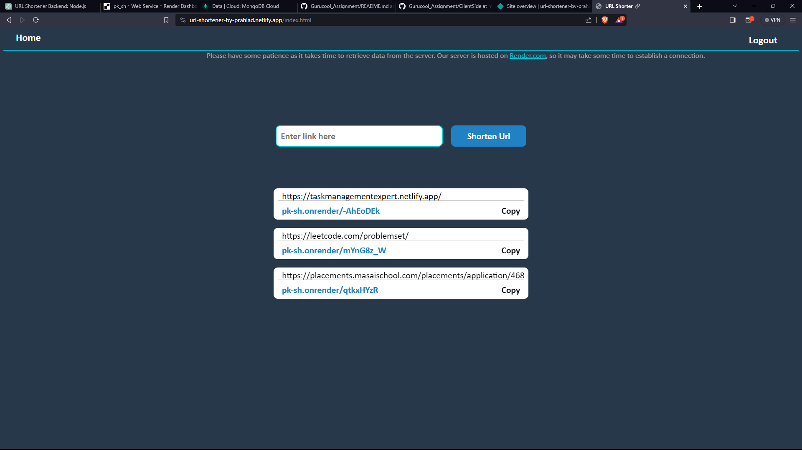
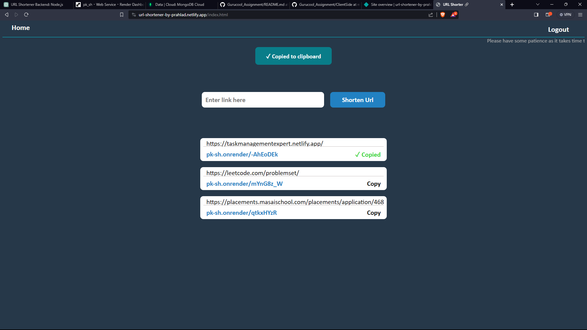

# URL Shortener App :-
 - Frontend Live Link 🔗:  `https://url-shortener-by-prahlad.netlify.app/`
 - Backend (Server) Link 🔗:  `https://pk-sh.onrender.com`

# URL Shortener Backend App Documentation

## Table of Contents
1. [Introduction](#introduction)
2. [Features](#features)
3. [Getting Started](#getting-started)
4. [Usage](#usage)
5. [Technical Details](#technical-details)
6. [API Documentation](#api-documentation)
7. [Future Improvements](#future-improvements)

## 1. Introduction
The URL Shortener App is a service that allows users to convert lengthy URLs into shorter, more manageable versions. This documentation provides an overview of the app's features, how to get started, and technical details.

## 2. Features
- Users can submit lengthy URLs through a POST request to `/shorten`.
- The API generates a unique short URL and stores it in the database.
- Response includes both the original and shortened URLs.
- Users can access the original URL by visiting the generated short URL.
- Basic user registration and login functionalities for secure access.

## 3. Getting Started With Server Side

### Prerequisites
- Node.js (LTS version)
- MongoDB
- mongoose

### Installation
1. Clone the repository. `git clone https://github.com/prahlad0x/Gurucool_Assignment/Server`
2. Open the  terminal.
3. Install dependencies: `npm install`
4. Configure environment variables. `Port : 8808, MongoDB Url, Secrect_key, saltRound`
5. Run the application: `npm run server`

## 4. Usage

### Shortening a URL
To shorten a URL, make a POST request to `api/url/shorten` with the original URL in req.body.

### Accessing the Original URL
Visit the generated short URL to be redirected to the original URL.

### User Registration and Login
Use `api/auth/register` to create a new user account and `api/auth/login` to log in securely.

## 5. Technical Details

### Backend
- Node.js (LTS)
- Express.js
- Jsonwebtoken
- Bcrypt

### Database
- MongoDB
- Mongoose

### Security
- Basic authentication (username and password)
- Authentication based on Tokens

## 6. API Documentation

### Endpoint: `api/url/shorten`
- Method: POST
- Parameters:
  - `originalUrl` (string): The URL to be shortened in `req.body oject`.
- Response:
  - `originalUrl` (string): Original URL.
  - `shortUrl` (string): Shortened URL.
  - `time`  (Date): Last Visit Time.

### Endpoint: `/:shortUrl`
- Method: GET
- Parameters:
  - `shortUrl` (string): The short URL generated by the app in `req.params`.
  - It will redirect to the original URL.

### Endpoint: `/api/auth/register`
- Method: POST
- Parameters:
  - `username` (string): User's username.
  - `password` (string): User's password.

### Endpoint: `/api/auth/login`
- Method: POST
- Parameters:
  - `username` (string): User's username.
  - `password` (string): User's password.
 
### Endpoint: `/api/auth/verify`
- Method: GET
- Parameters:
  - `token` (string): Previously generated token ( on time of registration/login ).

## 7. Code Quality

### Clean and Structured Code
- Codebase follows a modular and organized structure.

### Coding Practices
- Follows beginner-friendly coding practices.

# URL Shortener App - Frontend Documentation

## Table of Contents
1. [Introduction](#introduction)
2. [Features](#features)
3. [Getting Started](#getting-started)
4. [Usage](#usage)
5. [Components](#components)
6. [Technical Details](#technical-details)
7. [Code Quality](#code-quality)

## 1. Introduction
This documentation provides details on the frontend of the URL Shortener application. The frontend is responsible for user authentication, displaying the main interface, and interacting with the server for URL shortening and retrieval.

## 2. Features
- User authentication with login and register pages.
- Main page with a navigation bar, URL shortening form, and a container for displaying recently shortened URLs.
- Copy to clipboard functionality for the generated URLs.

## 3. Getting Started

### Prerequisites
- Any Browser

### Installation
1. Clone the repository. `git clone https://github.com/prahlad0x/Gurucool_Assignment/tree/main/ClientSide`
2. Open the index.html file with `live server` or `copy the path of file and run on Browser`

## 4. Usage

### Login/Register Page
- Parameters `User Email` and `password`
- Access the login/register page at `/login` and `/register`.
- Enter valid credentials for registration and login.

### Main Page
- After successful authentication, you will be redirected to the main page.
- The main page contains a navigation bar, a URL shortening form, and a container for displaying recent URLs.
  
## 5. Components

### Navbar
- Contains navigation links (e.g., Home, Logout).

### Shorten URL Form
- Input field to enter the URL to be shortened.
- Button to submit the form and make a POST request to the server.

### Recent URLs Container
- Displays a list of recently shortened URLs.
- Shows the original URL, newly generated URL, and a copy button for each entry.

## 6. Technical Details

### Authentication
- User authentication is handled securely using appropriate methods.

### API Requests
- Uses API requests to communicate with the backend for URL shortening and retrieval.

### Copy to Clipboard
- Implements a copy to clipboard functionality for the generated URLs.

## 7. Code Quality

### Clean and Structured Code
- Codebase follows a modular and organized structure.

## Images for Refrence

### Login-Page

*Caption: Login Page*

### Signup-Page

*Caption: Signup Page*

### Home-Page

*Caption: Main Page*

*Caption: Main Page*
